# Aphrodite

> *"As if you asked the goddess of beauty herself to build it — undeniably stunning UI, every time."*

Aphrodite is an **open, model-agnostic UI generation harness**. It is not a Claude Code plugin. It is a standalone runtime that any human or AI agent can call to get authentic, production-grade, *beautiful* user interfaces — by orchestrating today's UI tooling under a single **DESIGN.md**-grounded design contract.



## What works today (v0.1-dev)

A single command lands a complete, multi-mode design system into the caller's repo:

```bash
$ aphrodite design "A calm editorial landing page for a longevity clinic"
  Provider     : zai            # → glm-4.7, or anthropic/openrouter/offline
  Written      :
    • ./DESIGN.md               # Google-Labs alpha schema, 4 variants
    • ./hero.html               # self-contained, no external network at render
  Committed    : yes            # straight into the caller's git tree
  Validation   : PASS           # schema + WCAG-AA across every variant
```

Both surfaces are live:
- `aphrodite` — CLI for humans (and sub-shelling agents).
- `aphrodite-mcp` — JSON-RPC 2.0 over stdio, the **primary** Aphrodite surface under the agent-first contract.

`aphrodite design` produces four variants in one DESIGN.md: **light, dark, brand-a, brand-b**. Open `docs/demos/variants.html` for a side-by-side render.

## Install (from source, for now)

```bash
git clone <repo> && cd aphrodite
cargo install --path crates/aphrodite-cli  # gives you `aphrodite`
cargo install --path crates/aphrodite-mcp  # gives you `aphrodite-mcp`
```

## Pick your provider (priority: z.ai → Anthropic → OpenRouter → offline)

```bash
# z.ai GLM Coding Plan (recommended for now — cheapest, Anthropic-compatible)
aphrodite auth set zai          # paste key; stored in OS keychain
# or, headless:
APHRODITE_ZAI_API_KEY=... aphrodite design "..."

# Direct Anthropic:
aphrodite auth set anthropic

# OpenRouter (covers everything else):
aphrodite auth set openrouter

# No key? `aphrodite design` still works — falls back to a deterministic
# offline generator that emits a valid 4-variant DESIGN.md. Useful for CI.
```

Future (v0.2): OAuth flows for OpenAI / Moonshot-Kimi / Gemini. The credential
abstraction in `aphrodite-keyring` already reserves OAuth slots.

## Pillars

1. **Authentic agency.** Full-trust harness — a calling agent (or human) gets end-to-end authority to plan, design, and ship UI work. Default = direct commit to the caller's repo; `--no-write` emits to `.aphrodite/out/` instead. Deny-list policy gates only the catastrophic moves.
2. **Agent-first.** On any UX conflict, the JSON/MCP shape wins; the human CLI is a thin pretty layer over it. (See [seed](.ouroboros/seeds/seed_20260513T073417Z.yaml).)
3. **DESIGN.md as the contract.** Every project carries a Google-Labs-compatible `DESIGN.md` — the single source of truth shared across code, Figma, and 3D.
4. **Multi-mode from day one.** Every emitted DESIGN.md carries light + dark + ≥2 brand variants, all WCAG-AA-validated independently.
5. **Adaptive taste.** v0.1 records implicit aesthetic signals (regenerate, edit diffs) into a global ⊕ project taste store; v0.2 will surface an explicit jury layer on top.
6. **Open source.** Apache-2.0. Inspired in form by `oh-my-openagent`, `OpenHarness/Ohmo`, `opencode`, but scoped narrowly to *UI beauty*.

## Non-goals

- Not a general coding agent. (Use OpenCode / Claude Code / Codex for that — Aphrodite can be invoked *by* them over MCP.)
- Not a Claude Code skill or plugin.
- Not a hosted SaaS. Local-first.
- No Stitch integration (Stitch has no programmatic API; the Playwright-bridge path was explicitly rejected).

## Project layout

```
aphrodite/
├── DESIGN.md                          # Aphrodite's own visual identity (dogfood)
├── Cargo.toml                         # Rust workspace
├── crates/
│   ├── aphrodite-core/                # DESIGN.md model, validator, taste, policy, seed reader
│   ├── aphrodite-cli/                 # `aphrodite` binary
│   ├── aphrodite-mcp/                 # `aphrodite-mcp` JSON-RPC stdio server
│   ├── aphrodite-generator/           # provider router + hero renderer
│   └── aphrodite-keyring/             # OS keychain abstraction (the one secret-touching code path)
├── skills/                            # markdown skill packs (Anthropic SKILL.md shape)
│   └── editorial/
├── docs/
│   ├── vision.md / architecture.md
│   ├── adr/0001..0003                 # ADRs (revised post-seed)
│   ├── research/competitor-harnesses.md
│   └── demos/
│       ├── quickstart.svg             # animated terminal session
│       └── variants.html              # 4-variant hero showcase
└── .ouroboros/seeds/                  # immutable Ouroboros seed (v0.1 contract)
```

## License

[Apache-2.0](LICENSE).
